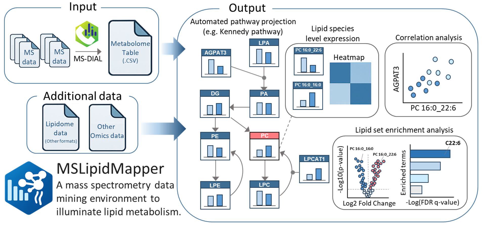

MSLipidMapper

<p align="center">
  
</p>

MSLipidMapper is an interactive Shiny dashboard for lipidomics data exploration.
It converts uploaded tables into a project built on `SummarizedExperiment` and provides normalization, exploratory plots, differential analysis, and Cytoscape.js-based pathway visualization.

---

## Features

- Import lipidomics tables from MS-DIAL alignment tables or generic wide-format CSV files
- `SummarizedExperiment`-based project structure
- Sample metadata editor for `sample_id` and `class`
- Normalization workflow with downloadable normalized data
- Analysis panels such as PCA, Heatmap, Volcano, and Correlation
- Pathway/network viewer with Cytoscape.js-based export

---

## Installation and launch

MSLipidMapper can be used in two ways:

- as an R package installed from GitHub
- as a Dockerized Shiny application

### Option 1: Install as an R package from GitHub

This is the recommended option if you want to run MSLipidMapper directly from R.

```r
install.packages("remotes")
remotes::install_github("systemsomicslab/MSLipidMapper")
```

Depending on your R environment, you may also need core Bioconductor packages:

```r
install.packages("BiocManager")
BiocManager::install(c("SummarizedExperiment", "S4Vectors", "ComplexHeatmap"))
```

Launch the app with:

```r
MSLipidMapper::run_mslipidmapper()
```

Notes:

- bundled example data and `lipid_rules.yaml` are included in the package
- no manual path configuration is required for standard use
- the app launches on port `3838` by default

### Option 2: Run with Docker

Docker remains available for users who prefer a containerized runtime.

#### Clone this repository

```bash
git clone "https://github.com/systemsomicslab/MSLipidMapper.git"
cd MSLipidMapper
```

#### Windows launcher

Windows users can start the container by double-clicking:

- `MSLipidMapper.bat`

Important:

- Docker Desktop must already be running

#### Manual Docker start

```bash
docker build -t mslipidmapper .
docker run --rm -p 3838:3838 -p 7310:7310 mslipidmapper
```

Open:

- Shiny app: `http://localhost:3838`
- Static server used for node images and related assets: `http://localhost:7310`

If you see `address already in use`, the port is already occupied.

---

## Prepare input files

MSLipidMapper does not accept raw MS files directly.
Prepare a table exported from MS-DIAL or a generic wide-format CSV file.

### Supported input types

#### A) MS-DIAL alignment table (recommended)

- Export the alignment result table from MS-DIAL as CSV or TSV
- The file should include:
  - annotation columns such as lipid name and class
  - sample intensity columns, one column per sample

MSLipidMapper reads the intensity matrix and constructs an analysis-ready object.

#### B) Generic wide-format CSV

A generic matrix is supported when your data are arranged as:

- rows: lipid molecules or features
- columns: samples
- cells: abundances or intensities

Minimum requirements:

- first column: feature ID such as a lipid name or unique identifier
- remaining columns: numeric intensities for samples

Tip:

- keep sample IDs consistent across lipidome, metadata, and transcriptome files

---

## Optional input files

### Sample metadata CSV

You can upload metadata separately for grouping, coloring, and statistical comparisons.

Requirements:

- one row per sample
- must contain a column matching the sample IDs in the lipidomics table
- additional columns may contain group, condition, timepoint, batch, or other metadata

In the app, you will map:

- `sample_id`
- `class`

### Transcriptome CSV

You can optionally load transcriptome data.
The app attempts to align samples by `sample_id` when possible.

This is used by multi-omics panels such as lipid-gene correlation when those modules are enabled.

---

## App workflow

### 1. Upload and edit

1. Choose input type: MS-DIAL or Generic.
2. Upload the lipidomics file.
3. Optionally upload sample metadata and transcriptome data.
4. Enter a unique project name.
5. Click `Submit` to build the project.

After upload, you can edit the sample table (`colData`) in the app.

Common fields:

- `sample_id`: unique sample identifier used across datasets
- `class`: group label used for coloring and comparisons
- `use`: `TRUE` or `FALSE` to include or exclude samples in downstream analysis

Notes:

- samples with `use = FALSE` are excluded from downstream analysis outputs
- columns assigned as `sample_id` or `class` are treated as metadata, not numeric assay values

### 2. Normalize

Go to the `Normalize` tab and run normalization to generate the normalized dataset.

- normalization is applied to the analysis-ready matrix
- normalized data can be downloaded from the app

### 3. Analysis

Depending on enabled modules, analysis may include:

- PCA and exploratory plots
- Heatmap views at class or molecule level
- Volcano and differential analysis
- Correlation analysis, including lipid-lipid and lipid-gene analysis

---

## Pathway analysis

Typical usage:

1. Load a network or pathway file such as `.cyjs`, `.gml`, or `.gpml`.
2. Nodes may represent lipid classes, molecules, genes, or pathway entities.
3. Clicking a node opens plots and related information.

Export options may include:

- PDF export of the network
- export of node-linked plots or images

---

## Example data

Bundled example inputs are available with the project.

Repository layout:

- `inst/examples/`

Installed R package layout:

- `system.file("extdata", "examples", package = "MSLipidMapper")`

Example R usage:

```r
example_dir <- system.file("extdata", "examples", package = "MSLipidMapper")
list.files(example_dir)
```

---
